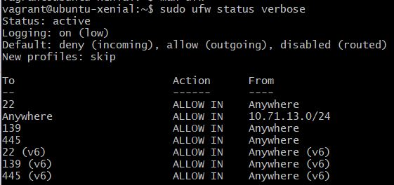
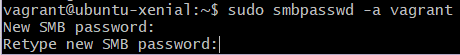
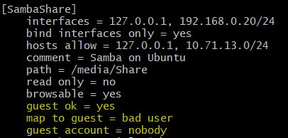
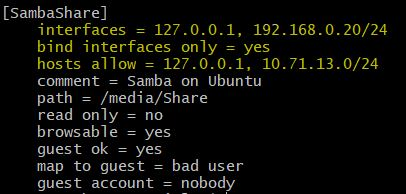

# M300
## LB1
Für die LB1 musste man ein Service auswählen und das Vagrantfile so anpassen, dass man mit vagrant up den laufenden Dienst hat.
Ich wählte dafür den Samba als Dienst, damit kann man über verschiedene OS auf dem Share Zugreifen.
> Note: Vagrant Version 2.2.3 und VirtualBox Version 5.2 wurden dabei benutzt

Samba einzurichten ist eigentlich nicht schwer. Ich bin dabei jedoch auf folgende Herausforderungen gestossen:
 * Password setzten für Vagrant User
 * Sich mit dem Share zu verbinden 

Das Vagrantfile kann man in mein Repository beim Unterordner files finden.
Hier wäre der direkte [Link][3]

### Sicherheitsaspekte
Damit der Server nicht leicht angreifbar ist, habe ich mit ufw (Uncomplicated Firewall) einige Regeln hinzufügt.
Folgend sieht man was ich alles gesetzt habe.

Standardmässig ist incoming und outgoing auf deny. Ich änderte jedoch default outgoing auf allow, da bei Samba eventuell mehrere Ports exposed werden müssen, als die zwei welche ich herausgesucht habe, habe ich diese Regel erstellt.
Da ich bei meiner Lösung kein Port Forwarding sondern bridged und eine Statische IP definiert habe, braucht man da zusätzlich eine Regel.

### Troubleshooting
#### smbpasswd
Zuerst hatte ich einige Probleme mit diesem Befehl gehabt: 
    
    sudo smbpasswd -a user 

Da man für Samba die User bestimmen muss, welche Zugriff haben, brauch man dann auch ein Passwort für sie zu setzen. Das macht man mit smbpasswd und das Passwort sollte dann zwei Mal eingeben werden, was eher schwierig zu realisieren ist mit ein Vagrantfile.

Ich hatte zuerst versucht ein Passwort File zu benutzen und so das Passwort zu setzen, dies war leider nicht erfolgreich.

Schlussendlich passte ich mein Share so an, damit Gast User Zugriff haben und die Authentifizierung somit wegfällt.
Das heisst ich muss die Berechtigung des Ordners, der geteilt wird, anpassen damit jeder Zugriff dort hat.

#### Zugriff zum Share
Das zweite Problem, welches ich auch nicht lösen konnte, ist der Zugriff selber zum Share.

Zuerst hatte ich Port Forwarding benutzt, als das nicht ging wurde mir der Tipp gegeben es mit bridge zu versuchen.
Dieser Versuch war leider auch nicht erfolgreich. Als nächstes sah ich auf einer Webseite, dass wenn man mehrere Netzwerkadapter hat, es beim smb.conf definieren kann wo der Zugriff überhaupt stattfindet und auch wer darauf überall Zugriff hat.

In der Firewall erstellte ich zum Schluss Regeln, welche Zugriff auf den Ports 139 und 445 zulässt.

### Fazit
Leider läuft der Dienst nicht, doch ich habe trotzdem einiges lernen können. Zum Beispiel weiss ich jetzt wie das Synchronisieren eines Ordners auf dem Host mit der vm in Vagrant funktioniert (obwohl ich das schlussendlich nicht mal gebraucht habe). Auch erfuhr ich wie wichtig es ist, wo man im Vagrantfile die Netzwerkeinstellungen anpasst, ich hatte dies eben am falschen Ort geschrieben und mich die ganze Zeit gewundert wieso es nicht funktionierte.

Für das nächste Mal hätte ich vielleicht mehr Zeit investieren können im Troubleshooting, denn ich bin mir sicher das ganze kann funktionieren. In Sache Sicherheit kann man da sicher noch einiges verbessern, wie ein Samba User und ein Reverse Proxy.

Was ich aus dieser LB mitnehmen konnte ist insgesamt recht vieles, denn das ist mein erstes Mal mit Vagrant zu arbeiten und Markdown zu benutzen.

---
Quellen:

* [Guide zum Aufsetzten][1]
* [Mehr Infos: Samba Server Configuration - Simple][2]
* [Vagrant: public_network][4]

[1]: https://tutorials.ubuntu.com/tutorial/install-and-configure-samba#0

[2]: https://help.ubuntu.com/community/Samba/SambaServerGuide?_ga=2.217325718.1849541421.1553230786-543561681.1550828100

[3]: https://github.com/nalmik/M300/blob/master/files/Vagrantfile

[4]: https://www.vagrantup.com/docs/networking/public_network.html
