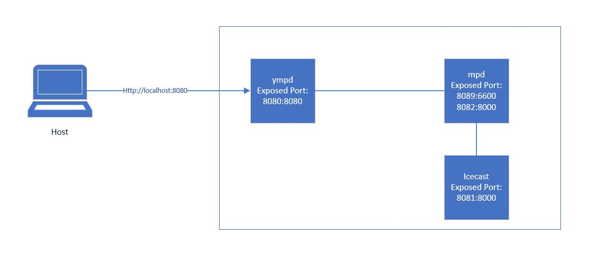
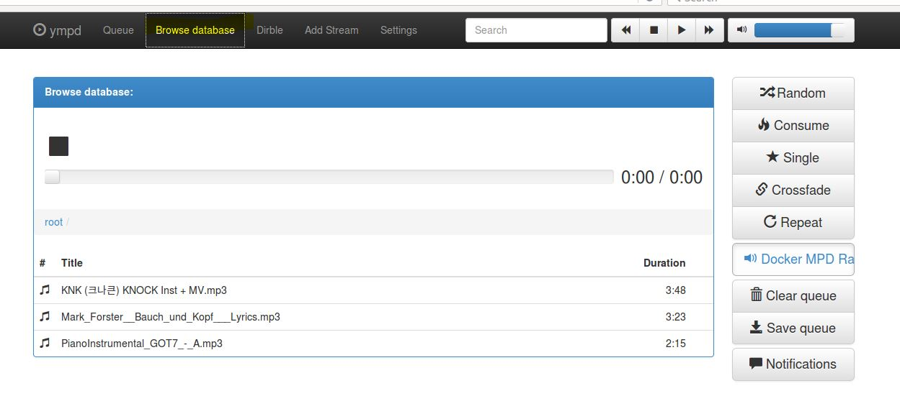
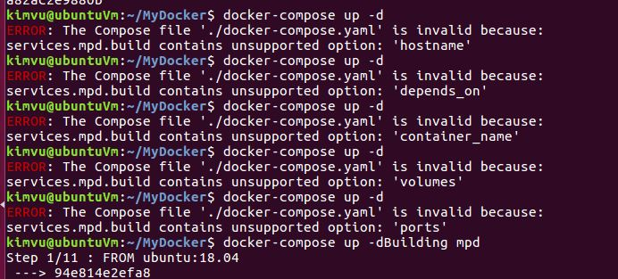
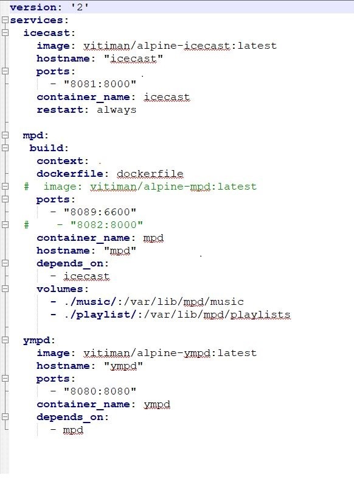
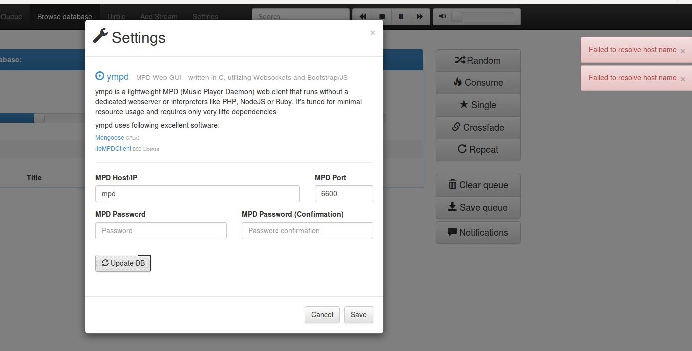

# M300

## Inhaltsverzeichnis

 * [LB1][50]
 * [LB2][60]

## LB1
Für die LB1 musste man ein Service auswählen und das Vagrantfile so anpassen, dass man mit vagrant up den laufenden Dienst hat.
Ich wählte dafür den Samba als Dienst, damit kann man über verschiedene OS auf dem Share Zugreifen.
> Note: Vagrant Version 2.2.3 und VirtualBox Version 5.2 wurden dabei benutzt

Samba einzurichten ist eigentlich nicht schwer. Ich bin dabei jedoch auf folgende Herausforderungen gestossen:
 * Password setzten für Vagrant User
 * Sich mit dem Share zu verbinden 

Das Vagrantfile kann man in mein Repository beim Unterordner files finden.
Hier wäre der direkte [Link][3]

### Sicherheitsaspekte
Damit der Server nicht leicht angreifbar ist, habe ich mit ufw (Uncomplicated Firewall) einige Regeln hinzufügt.
Folgend sieht man was ich alles gesetzt habe.

Standardmässig ist incoming und outgoing auf deny. Ich änderte jedoch default outgoing auf allow, da bei Samba eventuell mehrere Ports exposed werden müssen, als die zwei welche ich herausgesucht habe, habe ich diese Regel erstellt.
Da ich bei meiner Lösung kein Port Forwarding sondern bridged und eine Statische IP definiert habe, braucht man da zusätzlich eine Regel.

### Troubleshooting
#### smbpasswd
Zuerst hatte ich einige Probleme mit diesem Befehl gehabt: 
    
    sudo smbpasswd -a user 

Da man für Samba die User bestimmen muss, welche Zugriff haben, brauch man dann auch ein Passwort für sie zu setzen. Das macht man mit smbpasswd und das Passwort sollte dann zwei Mal eingeben werden, was eher schwierig zu realisieren ist mit ein Vagrantfile.

Ich hatte zuerst versucht ein Passwort File zu benutzen und so das Passwort zu setzen, dies war leider nicht erfolgreich.

Schlussendlich passte ich mein Share so an, damit Gast User Zugriff haben und die Authentifizierung somit wegfällt.
Das heisst ich muss die Berechtigung des Ordners, der geteilt wird, anpassen damit jeder Zugriff dort hat.

#### Zugriff zum Share
Das zweite Problem, welches ich auch nicht lösen konnte, ist der Zugriff selber zum Share.

Zuerst hatte ich Port Forwarding benutzt, als das nicht ging wurde mir der Tipp gegeben es mit bridge zu versuchen.
Dieser Versuch war leider auch nicht erfolgreich. Als nächstes sah ich auf einer Webseite, dass wenn man mehrere Netzwerkadapter hat, es beim smb.conf definieren kann wo der Zugriff überhaupt stattfindet und auch wer darauf überall Zugriff hat.

In der Firewall erstellte ich zum Schluss Regeln, welche Zugriff auf den Ports 139 und 445 zulässt.

### Fazit
Leider läuft der Dienst nicht, doch ich habe trotzdem einiges lernen können. Zum Beispiel weiss ich jetzt wie das Synchronisieren eines Ordners auf dem Host mit der vm in Vagrant funktioniert (obwohl ich das schlussendlich nicht mal gebraucht habe). Auch erfuhr ich wie wichtig es ist, wo man im Vagrantfile die Netzwerkeinstellungen anpasst, ich hatte dies eben am falschen Ort geschrieben und mich die ganze Zeit gewundert wieso es nicht funktionierte.

Für das nächste Mal hätte ich vielleicht mehr Zeit investieren können im Troubleshooting, denn ich bin mir sicher das ganze kann funktionieren. In Sache Sicherheit kann man da sicher noch einiges verbessern, wie ein Samba User und ein Reverse Proxy.

Was ich aus dieser LB mitnehmen konnte ist insgesamt recht vieles, denn das ist mein erstes Mal mit Vagrant zu arbeiten und Markdown zu benutzen.

>Quelle
>* [Guide zum Aufsetzten][1]
>* [Mehr Infos: Samba Server Configuration - Simple][2]
>* [Vagrant: public_network][4]

[1]: https://tutorials.ubuntu.com/tutorial/install-and-configure-samba#0

[2]: https://help.ubuntu.com/community/Samba/SambaServerGuide?_ga=2.217325718.1849541421.1553230786-543561681.1550828100

[3]: https://github.com/nalmik/M300/blob/master/files/Vagrantfile

[4]: https://www.vagrantup.com/docs/networking/public_network.html

***

## LB2
> Note:   
> Docker Toolbox und VirtualBox Version 5.2 wurden hier verwendet  

Ziel dieser LB ist es, dass man mit docker-compose drei Container erstellt und man mit dem Webgui Musik abspielen kann.

#### MPD
MPD steht für Music Player Daemon und wie der Name es schon sagt ist es ein Service das ermöglicht Musik abspielen zu lassen. Der VLC Media Player wäre so etwas ähnliches.

#### YMPD
 Dies ist ein WebGui mit dem man auf MPD zugreifen kann.

#### Icecast
Mit Icecast kann man Video oder Musik streamen. Man kann damit eigene Musik oder auch ein online Radio Sender laufen lassen.

## Netzwerkplan

Folgend wäre mein Netzwerkplan. Man erreicht denn Sevice wenn man beim Host localhost:8080 eingibt. MPD muss zwei Ports exposed haben, damit ympd und icecast sich damit verbinden können.

## Testing
Bevor man den Service Testen kann, sollte man die Ordner playlist und music erstellen. Dieser muss beim gleichen Ort sein wo auch das "docker-compose.yaml" File ist. Das File findet man beim Docker Ordner meines Repository: [docker-compose.yaml][5]  
Neben dem docker-compose.yaml und den beiden Ordner müsste man einige .mp3 im music Ordner haben.  
Den folgenden Befehl ausführen und dann sollte man mit localhost:8080 auf ympd kommen. Wenn man localhost:8081 eingibt sollte icecast auch auftauchen.
 > docker-compose up -d

Wenn man beim WebGUI unter Browser database geht, sollte man die Lieder vom music Ordner sehen. Wenn man nichts sieht, muss man eventuell bei Settings auf "Update DB" klicken

## Troubleshooting
Ich wollte zuerst den MPD Countainer nicht von einem image holen, sondern dafür ein eigenes Dockerfile erstellen.   
Zuerst hatte ich beim docker-compose up -d Ausführung immer den folgenden Fehler bekommen:

Da stellte sich heraus, dass ich im docker-compose.yaml nicht richtig eingerückt habe. Ports, volumes etc. müsste alle bei der gleichen Eben von build sein.  

Als ich nun das Problem oben gelöst habe, scheint so als funktionierte die Verbindung von mpd zu ympd nicht. Rechts erschien immer der Fehler, dass es den Host nicht erkennt oder die Verbindung es nicht erlaubt.

Das konnte ich leider in der zur verfügung gestellte Zeit nicht lösen, weshalb ich am Schluss auf eine image zurückgreifen musste. 
Wer es aber gern durchspielen will, kann sich das mpd.conf und Dockerfile zusätzlich runterladen und den auskommentierten build Teil wegmachen und dafür den Image Pfad auskommentieren.

## Fazit
Ich finde Docker recht spannend, ich hatte vielleicht nicht ganz so viel Zeit alles vertieft anzuschauen. Ich konnte aber schlussendlich vieles lernen. Folgendes Wissen habe ich mich jetzt angeeignet:
* Docker basics (Dockerfile, Docker Installation, docker run, images entfernen usw.)
* Docker-Compose (Docker-compose file, daraus images erstellen)
* MPD, YMPD und icecast

>Quelle
>* [How To Remove Docker Containers, Images, Volumes, and Networks][6]
>* [Install Docker Compose][7]
>* [Video: Creating a Music Player Server on Linux][8]

[5]: https://github.com/nalmik/M300/tree/master/docker/docker-compose.yaml
[6]: https://linuxize.com/post/how-to-remove-docker-images-containers-volumes-and-networks/
[7]: https://docs.docker.com/compose/install/
[8]: https://youtu.be/oZBtvQYUqt8?t=1220

[50]: https://github.com/nalmik/M300#lb1
[60]: https://github.com/nalmik/M300#lb2